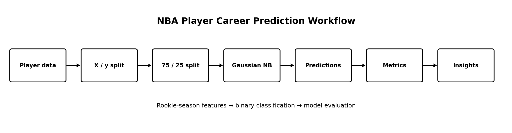
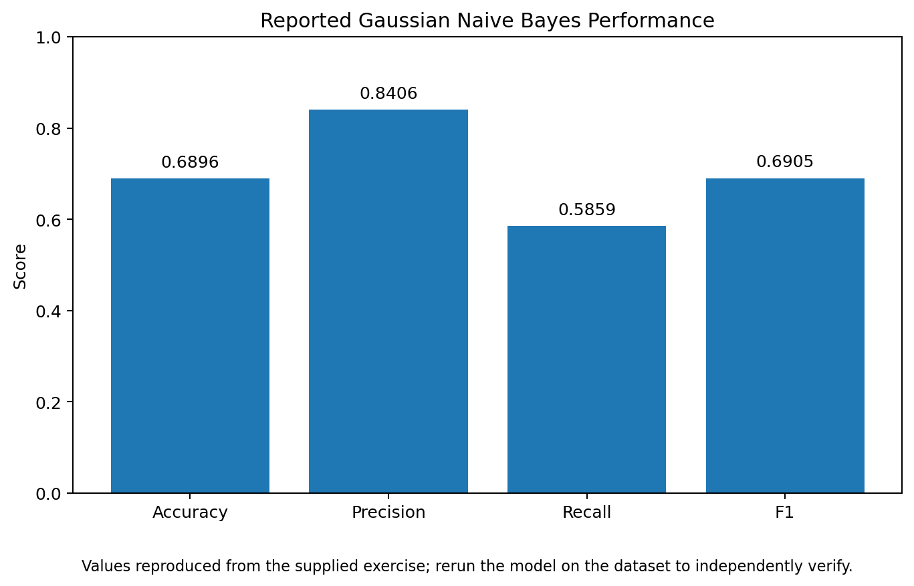

# NBA Player Career Prediction with Gaussian Naive Bayes


A machine learning classification project that uses **Gaussian Naive Bayes** to predict whether an NBA player will have a career lasting **five years or more**, based on rookie-season performance features.

> **Project type:** Machine Learning / Classification  
> **Target:** `target_5yrs`  
> **Model:** Gaussian Naive Bayes

## Project Overview

Professional basketball teams and analysts may be interested in identifying player characteristics associated with longer careers.

This project uses a prepared NBA player dataset containing **1,341 observations**, where each observation represents a different player. The target variable, `target_5yrs`, is binary and indicates whether the player's NBA career lasted five years or more.

The workflow demonstrates how to prepare the data, select an appropriate Naive Bayes implementation, train the classifier, generate predictions, and evaluate performance using multiple classification metrics.

## Business Question

**Can rookie-season performance features be used to predict whether an NBA player will remain in the league for at least five years?**

The model treats this as a **binary classification problem**:

```text
0 → Career does not reach 5 years
1 → Career reaches 5 years or more
```

## Analytical Workflow



1. Load the feature-engineered NBA player dataset.
2. Separate the target variable from predictor variables.
3. Split the data into training and testing sets.
4. Select Gaussian Naive Bayes because the predictors are continuous numerical features and the exercise assumes approximately normal distributions.
5. Train the classifier on the training data.
6. Predict career-duration outcomes for the unseen test set.
7. Evaluate the predictions using accuracy, precision, recall, F1 score, and a confusion matrix.
8. Translate the results into stakeholder-friendly insights.

## Model Preparation

The target is isolated as:

```python
y = extracted_data["target_5yrs"]
```

The predictors are created by removing the target:

```python
X = extracted_data.drop("target_5yrs", axis=1)
```

The source exercise reports:

- **1,341 total observations**
- **1,005 training observations**
- **335 test observations**
- **75% training / 25% test split**
- **10 predictor columns**
- **1 binary target column**

The split uses:

```python
train_test_split(
    X,
    y,
    test_size=0.25,
    random_state=0
)
```

## Why Gaussian Naive Bayes?

The supplied analysis identifies the predictors as continuous numerical values and the task as binary classification.

Based on those characteristics, the exercise selects:

```python
GaussianNB()
```

Gaussian Naive Bayes models the class probability using the assumption that continuous features follow approximately Gaussian distributions within each class.

## Model Training

The classifier is fitted using the training data:

```python
nb = GaussianNB()
nb.fit(X_train, y_train)
y_pred = nb.predict(X_test)
```

This allows the model to learn relationships from the training observations before generating predictions for previously unseen test observations.

## Model Evaluation

The supplied exercise reports the following test-set metrics:

| Metric | Reported Score |
|---|---:|
| Accuracy | **0.6896** |
| Precision | **0.8406** |
| Recall | **0.5859** |
| F1 Score | **0.6905** |



### Accuracy — 68.96%

The model correctly classified approximately 69% of the test observations.

However, accuracy alone does not provide a complete view of classification performance, particularly when the classes may not be evenly distributed.

### Precision — 84.06%

The reported precision is higher than the recall score.

In the supplied analysis, this means that among the observations predicted as the positive class, a relatively high proportion were actually positive.

### Recall — 58.59%

The reported recall is lower than precision.

This indicates that the model did not identify all actual positive cases. In the source analysis, this is discussed in terms of the balance between true positives and false negatives.

### F1 Score — 69.05%

The F1 score combines precision and recall into a single measure.

The supplied analysis describes the resulting F1 score as indicating reasonable predictive power while emphasizing that the model performs differently across the two types of classification errors.

## Confusion Matrix

The confusion matrix provides a more detailed view of:

- True positives
- True negatives
- False positives
- False negatives

The source analysis notes that the concentration of true positives contributes to the relatively high precision, while the relationship between true negatives and false negatives helps explain the lower recall.

The reusable analysis script generates the confusion matrix automatically when the dataset is supplied.

## Stakeholder Interpretation

The supplied analysis concludes that the model provides **some value** for predicting whether an NBA player's career will last five years or more.

An important observation is that the model performs better at identifying players in the positive class than it does at identifying players who will not reach five years, based on the reported precision and recall values.

For a stakeholder discussion, the model should therefore be presented using the full set of evaluation metrics rather than accuracy alone.

## Key Takeaways

- Train-test splitting provides unseen data for evaluating model performance.
- Gaussian Naive Bayes is appropriate for the binary classification setup described in the exercise.
- Accuracy alone does not fully describe classification performance.
- Precision and recall provide complementary information about prediction errors.
- The F1 score summarizes the balance between precision and recall.
- A confusion matrix makes the types of correct and incorrect predictions easier to interpret.
- Model evaluation is essential before using predictions to support decisions.

## Tools & Technologies

| Tool | Purpose |
|---|---|
| Python | Machine learning workflow |
| Pandas | Data loading and manipulation |
| Scikit-learn | Model training and evaluation |
| Gaussian Naive Bayes | Binary classification |
| Matplotlib | Model-performance visualisation |

## Skills Demonstrated

- Data preparation
- Feature/target separation
- Train-test splitting
- Supervised machine learning
- Binary classification
- Gaussian Naive Bayes
- Model prediction
- Accuracy, precision, recall and F1 evaluation
- Confusion matrix interpretation
- Stakeholder communication

## Repository Structure

```text
nba-naive-bayes-player-career-prediction/
│
├── README.md
├── nba_naive_bayes.py
├── hypothesis_testing_source.py
├── data/
│   └── README.md
├── figures/
│   ├── analysis_workflow.png
│   └── model_performance.png
└── .github/
    └── workflows/
        └── python-check.yml
```

## How to Run

### 1. Clone the repository

```bash
git clone https://github.com/YOUR-USERNAME/nba-naive-bayes-player-career-prediction.git
cd nba-naive-bayes-player-career-prediction
```

### 2. Install dependencies

```bash
pip install pandas scikit-learn matplotlib
```

### 3. Add the dataset

Place:

```text
extracted_nba_players_data.csv
```

inside the `data/` folder.

### 4. Run the model

```bash
python nba_naive_bayes.py
```

The script prints the evaluation metrics and saves the confusion matrix to the `figures/` directory.

## Data

The prepared dataset is not redistributed in this repository. The source exercise states that the dataset contains rookie-year NBA performance statistics and a `target_5yrs` target variable.

The repository's `data/README.md` documents the expected file and target column.

## Portfolio Note

This repository converts the supplied course exercise into a cleaner, portfolio-oriented machine learning project.

The original source material is retained separately for reference, while `nba_naive_bayes.py` provides a reusable script that focuses on the actual machine learning workflow.

## Limitations

The reported results are those documented in the supplied exercise. Independent verification requires running the model against the corresponding prepared dataset.

The model should therefore be viewed as an analytical demonstration rather than a production system for making player-management decisions.

